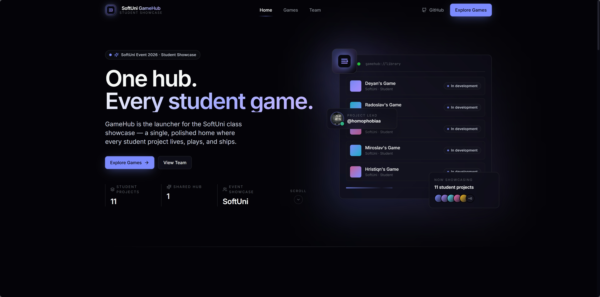
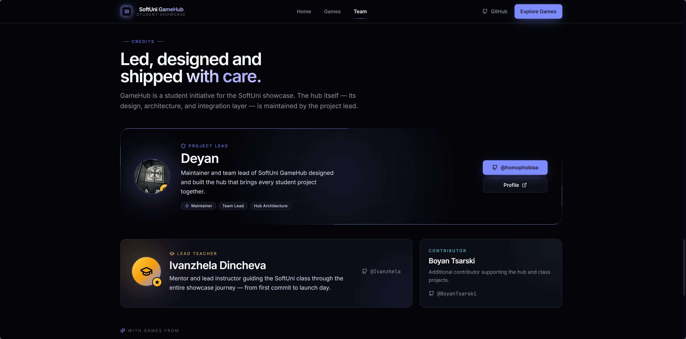
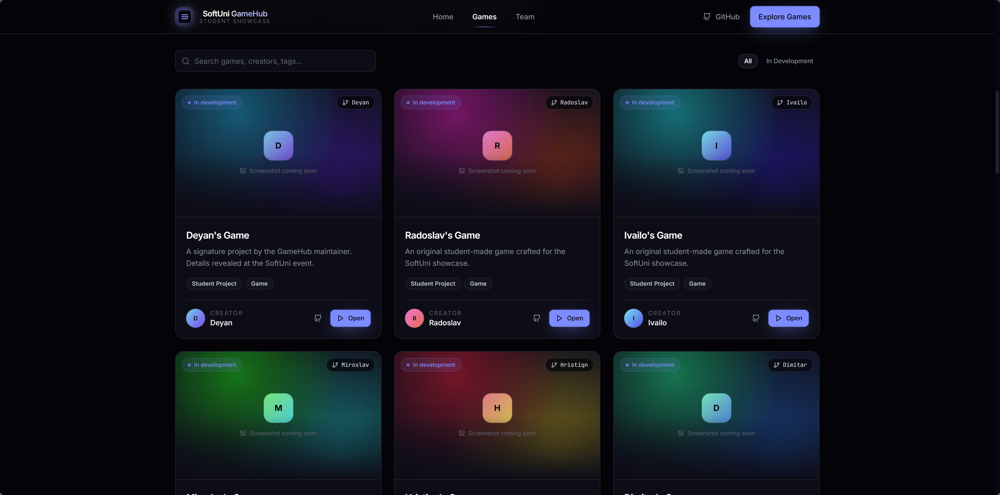

# SoftUni GameHub


<div align="center">


A community-driven game showcase platform created for a SoftUni school event.

This project combines multiple student-made games into a single modern platform where visitors can browse, launch, and experience different projects in one place.

<br/>

🌐 **Website:** [gamehubbg.com](https://gamehubbg.com?utm_source=github.com)

</div>

---

# About The Project

SoftUni GameHub is designed as a central place for showcasing student projects during the event.

Instead of every game existing separately, the platform brings everything together into one polished experience with:

- A modern game launcher
- Individual game pages
- Clean UI/UX
- Easy navigation
- Standalone game integrations
- Expandable architecture for future events

Each game is developed independently by different students and integrated into the platform as its own experience.

---

# Platform Preview

## Main Hub

> Main landing page / launcher screenshot

<p align="center">
  
  
  
</p>
---

# Games

---

## 🎯 Deyan

### Description
Short description coming soon.

### Preview


---

## 🎯 Radoslav

### Description
Short description coming soon.

### Preview


---

## 🎯 Ivailo

### Description
Short description coming soon.

### Preview


---

## 🎯 Miroslav

### Description
Short description coming soon.

### Preview


---

## 🎯 Hristiqn

### Description
Short description coming soon.

### Preview


---

## 🎯 Dimitar

### Description
Short description coming soon.

### Preview


---

## 🎯 Lubo

### Description
Short description coming soon.

### Preview


---

## 🎯 Slav

### Description
Short description coming soon.

### Preview


---

## 🎯 Damyan

### Description
Short description coming soon.

### Preview


---

## 🎯 Viktor

### Description
Short description coming soon.

### Preview


---

## 🎯 Filip-Boqn

### Description
Short description coming soon.

### Preview


---

# 🛠️ Technologies

- React
- Vite
- TypeScript
- HTML5 Canvas
- JavaScript
- CSS / TailwindCSS

---

# 📂 Project Structure

```text
GameHub/
│
├── GameHub/
│
├── Games/
│    ├── deyan/
│    ├── radoslav/
│    ├── ivailo/
│    ├── miroslav/
│    └── ...
│
├── docs/
│    ├── screenshots/
│    └── ...
│
└── README.md
```

---

# 👨‍💻 Contributors

| Student    |
| ---------- |
| Deyan - Team Leader|
| Radoslav   |
| Ivailo     |
| Miroslav   |
| Hristiqn   |
| Dimitar    |
| Lubo       |
| Slav       |
| Damyan     |
| Viktor     |
| Filip-Boqn |

---

# 🌟 Goals

* Showcase student creativity
* Present multiple game concepts in one platform
* Create a polished event-ready experience
* Make adding future games easy
* Encourage collaboration between students

---

# 📌 Notes

Each student works independently on their own game branch while the main hub remains organized and stable.

Games may use different technologies internally, but all projects are integrated into the same platform experience.

---

# 📄 License

This project is intended for educational and showcase purposes as part of a SoftUni school event.
