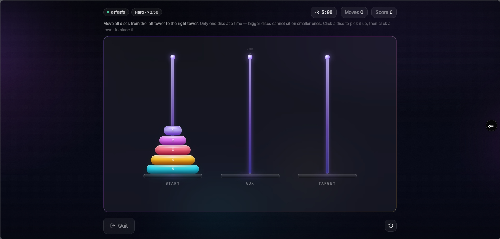
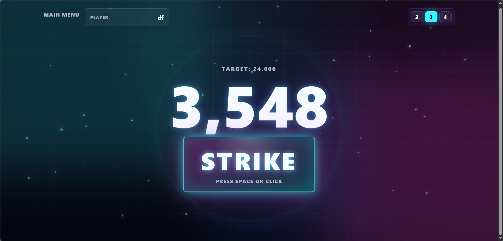
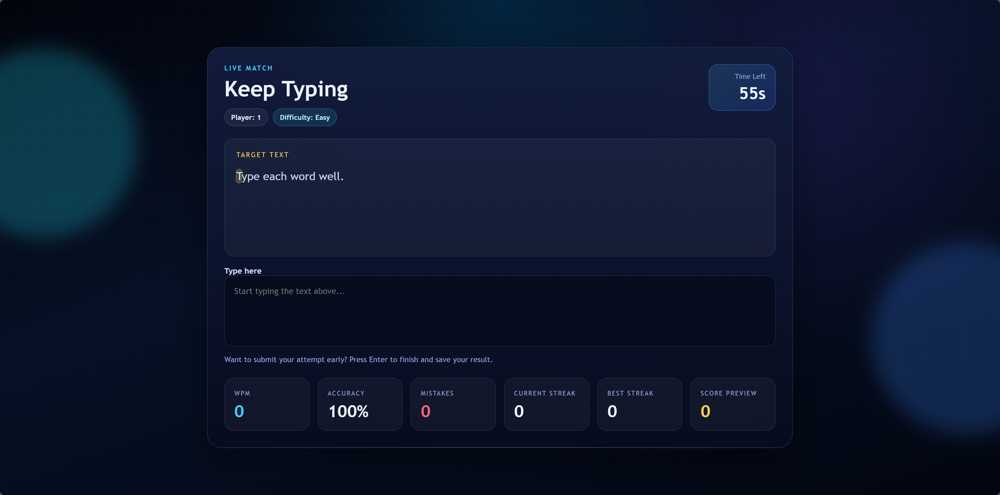
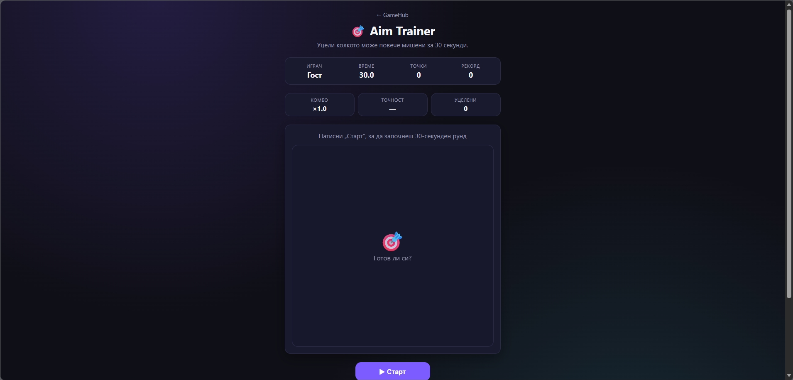
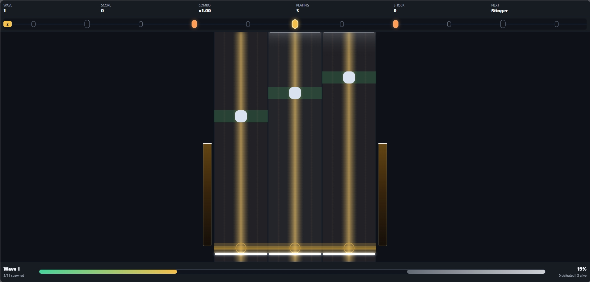
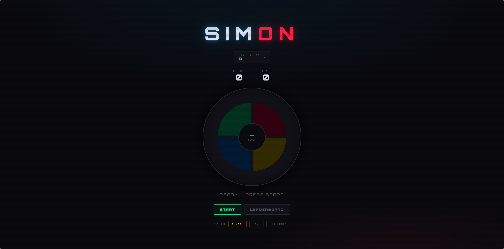
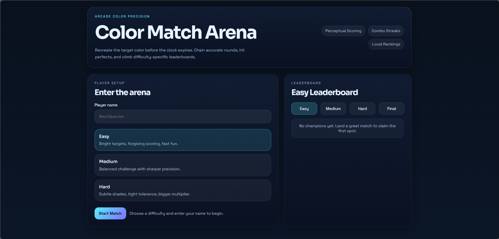
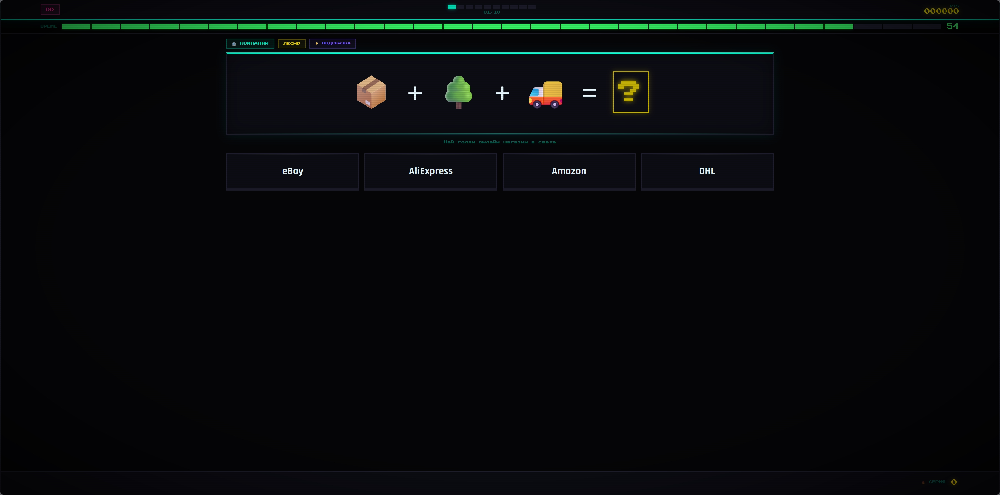

# SoftUni GameHub


<div align="center">


A community-driven game showcase platform created for a SoftUni school event.

This project combines multiple student-made games into a single modern platform where visitors can browse, launch, and experience different projects in one place.

<br/>

🌐 **Website:** [gamehubbg.com](https://gamehubbg.com?utm_source=github.com)

</div>

---

# About The Project

SoftUni GameHub is designed as a central place for showcasing student projects during the event.

Instead of every game existing separately, the platform brings everything together into one polished experience with:

- A modern game launcher
- Individual game pages
- Clean UI/UX
- Easy navigation
- Standalone game integrations
- Expandable architecture for future events

Each game is developed independently by different students and integrated into the platform as its own experience.

---

# Platform Preview

## Main Hub

> Main landing page / launcher screenshot

<p align="center">
  
  
  
</p>

# Games

---

## 🎯 Deyan

### Description
A chaotic speed-based twist on the classic Tower of Hanoi where players race against time and each other to solve increasingly difficult puzzles with competitive mechanics and arcade-style pressure.

### Preview



---

## 🎯 Radoslav

### Description
A fast-paced neon reflex arcade game where players must stop a precision timer as close as possible to a randomly generated target second.

### Preview



---

## 🎯 Ivailo

### Description
Test your typing speed in this fast-paced arena. How many words per minute can you hit?

### Preview



---

## 🎯 Miroslav

### Description
Sharpen your reflexes and mouse accuracy in this simple but addictive aim trainer.

### Preview



---

## 🎯 Hristiqn

### Description
A classic card-matching memory game. Flip the cards, find the pairs, and beat your best score.

### Preview


---

## 🎯 Dimitar

### Description
An original student-made game created for the SoftUni Buditel game showcase.

### Preview


---

## 🎯 Lubo

### Description
Test your reflexes by clicking highlighted cells as fast as possible in this grid-based reaction challenge.

### Preview


---

## 🎯 Slav

### Description
A lane-based rhythm shooter where you build and rearrange a looping bullet timeline, then time your shots across three lanes to survive escalating enemy waves.

### Preview



---

## 🎯 Damyan

### Description
A classic Simon Says sequence game. Watch the pattern, repeat it correctly, and see how far you can go.

### Preview



---

## 🎯 Viktor

### Description
A colorful arcade challenge focused on matching colors quickly and accurately.

### Preview



---

## 🎯 Filip & Boyan

### Description
A premium dark-themed emoji puzzle game featuring 65+ challenges across 8 categories. Decode the hidden logic behind each emoji sequence.

### Preview



---

# 🛠️ Technologies

- React
- Vite
- TypeScript
- HTML5 Canvas
- JavaScript
- CSS / TailwindCSS

---

# 📂 Project Structure

```text
GameHub/
│
├── GameHub/
│
├── Games/
│    ├── deyan/
│    ├── radoslav/
│    ├── ivailo/
│    ├── miroslav/
│    └── ...
│
├── docs/
│    ├── screenshots/
│    └── ...
│
└── README.md
```

---

# 👨‍💻 Contributors

| Student    |
| ---------- |
| Deyan - Team Leader|
| Radoslav   |
| Ivailo     |
| Miroslav   |
| Hristiqn   |
| Dimitar    |
| Lubo       |
| Slav       |
| Damyan     |
| Viktor     |
| Filip-Boqn |

---

# 🌟 Goals

* Showcase student creativity
* Present multiple game concepts in one platform
* Create a polished event-ready experience
* Make adding future games easy
* Encourage collaboration between students

---

# 📌 Notes

Each student works independently on their own game branch while the main hub remains organized and stable.

Games may use different technologies internally, but all projects are integrated into the same platform experience.

---

# 📄 License

This project is intended for educational and showcase purposes as part of a SoftUni school event.
